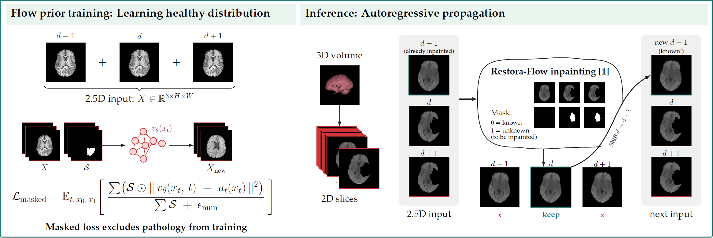

# Zero-Shot Brain MRI Inpainting with 2.5D Unconditional Flow Priors

[](https://papers.miccai.org/miccai-2026-sat/BraTS_Inpainting_003.html)
[](https://challenges.synapse.org/Challenges/DetailsPage/Task4?id=syn74274097)

Official PyTorch implementation of the paper **"Zero-Shot Brain MRI Inpainting with 2.5D Unconditional Flow Priors"**, developed for the **BraTS 2026 Inpainting Challenge**.
The task is to perform anatomically plausible 3D completion of occluded areas in T1-weighted MRI scans. 

---

## Method Overview

This repository implements a 2.5D flow matching framework for brain MRI inpainting without task-specific conditional training:
* **2.5D Generative Flow Prior:** An unconditional flow matching model trained directly in pixel space on adjacent axial slice triplets $\{d-1, d, d+1\}$ to capture spatial context along the depth axis.
* **Zero-Shot Inpainting:** Utilizes [Restora-Flow](https://openaccess.thecvf.com/content/WACV2026/papers/Hadzic_Restora-Flow_Mask-Guided_Image_Restoration_with_Flow_Matching_WACV_2026_paper.pdf) at inference to reconstruct voided brain tissue while preserving surrounding intact anatomy.
* **Autoregressive Propagation:** Inpaints full 3D volumes slice-by-slice along the superior-inferior axis, feeding previous reconstructions into subsequent steps to ensure volumetric continuity and eliminate 2D inter-slice stacking artifacts.

<p align="center">
  
</p>

---

## Repository Structure

```text
├── dataset/
│   └── setup/
│       ├── train.txt               # Internal training split (90% of challenge training set)
│       └── val.txt                 # Internal validation split (10% of challenge training set)
├── input/                         
│   └── BraTS-GLI-00001-000         # Example BraTS patient folder        
│       ├── BraTS-GLI-00001-000-t1n-voided.nii.gz        
│       └── BraTS-GLI-00001-000-mask.nii.gz 
├── models/
│   └── model-10k.pt                 # Pretrained 2.5D flow matching checkpoint
├── output/                        
│   └── BraTS-GLI-00001-000.nii.gz  # Inpainted prediction
├── train_2_5D_uncond.py            # Training script for 2.5D flow model
├── sample_single.py                # Inference script for a single reconstruction
├── sample_ensemble.py              # Inference script for ensemble averaging
├── requirements.txt                # Python dependencies
└── README.md
```

---

## Installation

   ```bash
   git clone https://github.com/imigraz/brats2026-inpainting.git
   cd brats2026-inpainting
   
   conda create -n brats-flow python=3.10 -y
   conda activate brats-flow
   
   pip install -r requirements.txt
   ```
---

## Data

The model is developed and benchmarked on the **BraTS 2026 Inpainting Challenge** dataset.
* Place the dataset inside a directory (e.g., `data/`).
* The files `dataset/setup/train.txt` and `dataset/setup/val.txt` specify the patient-wise 90/10 split used during ablation and internal validation.
* Preprocessing includes center-cropping volumes to $208 \times 208 \times 144$ and normalizing intensities to $[-1, 1]$. Outputs are automatically re-scaled to the initial intensity ranges and padded back to the original $240 \times 240 \times 155$ resolution.
* Place individual patient folders inside input/ for inference.
---

## Pretrained Checkpoint

Download our pretrained model checkpoint (`model-10k.pt`, trained for 10,000 epochs on all 1,251 challenge training cases) via:
```bash
pip install gdown
bash download_checkpoint.sh
```

The checkpoint will be saved to `models/model-10k.pt`.

---

## Inference

Place the patient folder to reconstruct inside `input/` (e.g., `input/BraTS-GLI-00001-000`).

### 1. Single Reconstruction

To inpaint a volume using a single sampling trajectory ($N=1$, 32 ODE steps):

```bash
python sample_single.py \
    --input_path input/BraTS-GLI-00001-000/BraTS-GLI-00001-000-t1n-voided.nii.gz \
    --mask_path input/BraTS-GLI-00001-000/BraTS-GLI-00001-000-mask.nii.gz \
    --checkpoint models/model-10k.pt \
    --ode_steps 32
```


### 2. Generative Ensemble

To inpaint a volume using ensemble averaging (e.g. $N=10$, 32 ODE steps):

```bash
python sample_ensemble.py \
    --input_path input/BraTS-GLI-00001-000/BraTS-GLI-00001-000-t1n-voided.nii.gz \
    --mask_path input/BraTS-GLI-00001-000/BraTS-GLI-00001-000-mask.nii.gz \
    --checkpoint models/model-10k.pt \
    --n_samples 10 \
    --ode_steps 32
```

Reconstructed volumes are saved to `output/<sample_id>.nii.gz`.

---

## Training

To train the 2.5D unconditional flow matching prior from scratch:

```bash
python train_2_5D_uncond.py \
    --train_setup dataset/setup/train.txt \
    --val_setup dataset/setup/val.txt \
    --epochs 5000 \
    --batch_size 16 \
    --lr 1e-4 \
    --ode_steps 32 \
    --save_dir experiments/train
```

---


## Citation

If you find this code or method useful for your research, please cite our papers:

```bibtex
@InProceedings{HadArn_ZeroShot_MICCAISAT2026,
   author    = {Hadzic, Arnela and Thaler, Franz and Joham, Simon Johannes and Urschler, Martin},
   title     = {{Zero-Shot Brain MRI Inpainting with 2.5D Unconditional Flow Priors}},
   booktitle = {Medical Image Computing and Computer Assisted Intervention -- MICCAI 2026 Workshops and Challenges},
   year      = {2026},
   publisher = {Springer Nature Switzerland},
   volume    = {LNCS 17254},
   month     = {pending},
   page      = {pending}
}

@inproceedings{hadzic2026restora,
   author    = {Hadzic, Arnela and Thaler, Franz and Bogensperger, Lea and Joham, Simon Johannes and Urschler, Martin},
   title     = {{Restora-Flow: Mask-Guided Image Restoration with Flow Matching}},
   booktitle = {Proceedings of the IEEE/CVF Winter Conference on Applications of Computer Vision (WACV)},
   year      = {2026},
   pages     = {4943--4952},
   doi       = {10.1109/WACV61042.2026.00480}
}
```

